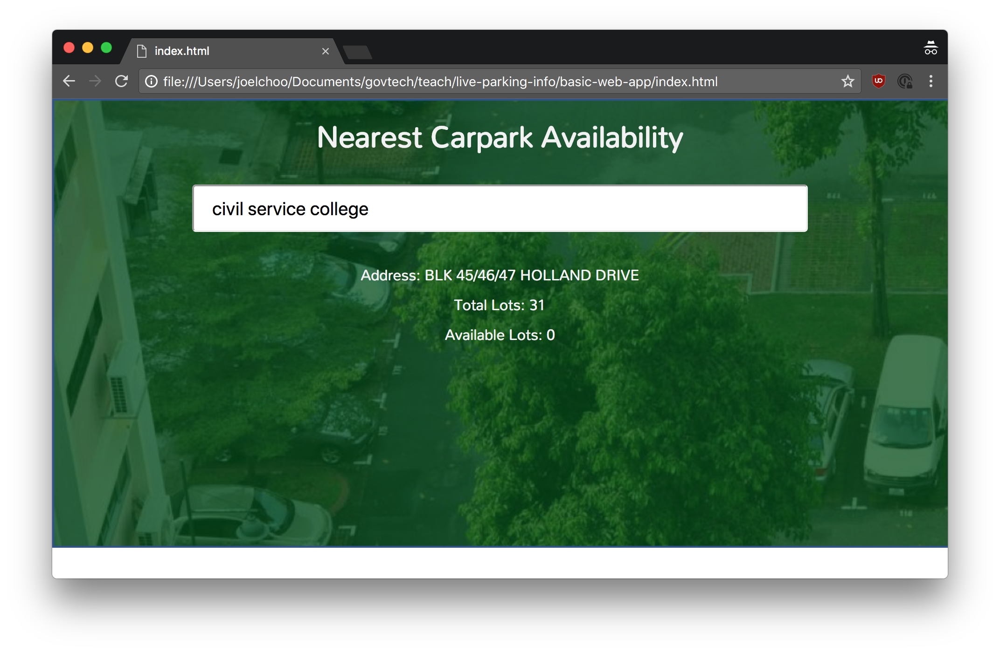
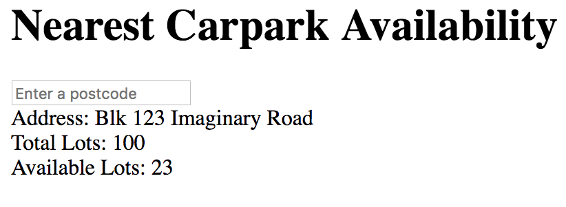

slidenumbers: true

# Build your own web app

---

# Why?

* NOT to become a software engineer
* Show you basics of how web apps work
* Have more meaningful discussion about web applications (understand the lingo)
* Give you confidence to learn more/explore about code!
* Give you something real to take home!

---

# What you're going to build



---

# Outline

1. What is a website?
1. Displaying text
1. Adding interaction
1. Communicating with other apps
1. Adding styles!

---

# Before we begin

* Slides are provided as handouts
* You can also refer to digital copy of the slides

<!-- * Copy paste out from the slides -->

---

# Let's get started!

## Displaying some text



---

# Setup

Open the folder using Atom.

Open the `index.html` file using Google Chrome.

---

```html
hello
```

\-\-\-\-\-\-\-\-\-\-\-\-\-\-\-\-\-\-\-\-\-\-\-\-\-\-\-\-\-\-\-\-\-\-\-\-\-\-\-\-\-\-\-\-\-\-\-\-\-\-\-\-\-\-\-\-\-\-

* Save the file and refresh the page in Chrome
* Websites are just text files interpreted by the browser
* HTML files specify the content that the browser should display

---

```html
<body>
  hello
</body>
```

^ html, body, opening and closing tags

---

```html
<body>
  hello there!
</body>
```

---

```html
<body>
  hello

  there!
</body>
```

\-\-\-\-\-\-\-\-\-\-\-\-\-\-\-\-\-\-\-\-\-\-\-\-\-\-\-\-\-\-\-\-\-\-\-\-\-\-\-\-\-\-\-\-\-\-\-\-\-\-\-\-\-\-\-\-\-\-

* HTML has a specific way of formatting content
* What you see is not what you get

^ html does not care about your file. just a structure

---

```html, [.highlight: 2]
<body>
  <h1>hello</h1>

  there!
</body>
```

\-\-\-\-\-\-\-\-\-\-\-\-\-\-\-\-\-\-\-\-\-\-\-\-\-\-\-\-\-\-\-\-\-\-\-\-\-\-\-\-\-\-\-\-\-\-\-\-\-\-\-\-\-\-\-\-\-\-

* The `h1` tag makes the content inside become a **header**

^ different tags, a bit of styles

---

```html
<body>
  <h1>Nearest Carpark Availability</h1>
</body>
```

---

```html, [.highlight: 3]
<body>
  <h1>Nearest Carpark Availability</h1>
  <input>
</body>
```

\-\-\-\-\-\-\-\-\-\-\-\-\-\-\-\-\-\-\-\-\-\-\-\-\-\-\-\-\-\-\-\-\-\-\-\-\-\-\-\-\-\-\-\-\-\-\-\-\-\-\-\-\-\-\-\-\-\-

* `input` creates an input box
* `input` is a basic element, does not require a closing tag

---

```html, [.highlight: 3]
<body>
  <h1>Nearest Carpark Availability</h1>
  <input placeholder="Enter a postcode">
</body>
```

\-\-\-\-\-\-\-\-\-\-\-\-\-\-\-\-\-\-\-\-\-\-\-\-\-\-\-\-\-\-\-\-\-\-\-\-\-\-\-\-\-\-\-\-\-\-\-\-\-\-\-\-\-\-\-\-\-\-

* HTML elements/tags can have extra **attributes** given to them
* These **attributes** can change the behaviour and appearance of the element

---

```html, [.highlight: 5]
<body>
  <h1>Nearest Carpark Availability</h1>
  <input placeholder="Enter a postcode">

  <div>Hello!</div>
</body>
```

\-\-\-\-\-\-\-\-\-\-\-\-\-\-\-\-\-\-\-\-\-\-\-\-\-\-\-\-\-\-\-\-\-\-\-\-\-\-\-\-\-\-\-\-\-\-\-\-\-\-\-\-\-\-\-\-\-\-

`div` is a generic container

---

```html
<body>
  <h1>Nearest Carpark Availability</h1>
  <input placeholder="Enter a postcode">

  <div>Address: Blk 123 Imaginary Road</div>
  <div>Total Lots: 456</div>
  <div>Available Lots: 78</div>
</body>
```

\-\-\-\-\-\-\-\-\-\-\-\-\-\-\-\-\-\-\-\-\-\-\-\-\-\-\-\-\-\-\-\-\-\-\-\-\-\-\-\-\-\-\-\-\-\-\-\-\-\-\-\-\-\-\-\-\-\-

`div`s can be used to organise and arrange content

---

# A short detour

Adding styles to your page!

```html
<body style="background-color: lightskyblue">
  .
  .
  .
</body>
```

[https://developer.mozilla.org/en-US/docs/Web/CSS/color_value](https://developer.mozilla.org/en-US/docs/Web/CSS/color_value)

---

# A quick recap

* HTML files in browser are webpages
* HTML tells the browser what to display 
* HTML tags, attributes

---

# What's next

Javascript

---

# Metaphor - the human body

| Term         | Metaphor | Function            |
|--------------|----------|---------------------|
| HTML         | Skeleton | Structure           |
| CSS (styles) | Skin     | Styling, formatting |
| Javascript   | Brain    | Behaviour/actions   |

---

```html, [.highlight: 10]
<body>
  <h1>Nearest Carpark Availability</h1>
  <input placeholder="Enter a postcode">

  <div>Address: Blk 123 Imaginary Road</div>
  <div>Total Lots: 456</div>
  <div>Available Lots: 78</div>
</body>

<script> alert("Hello!") </script>
```

\-\-\-\-\-\-\-\-\-\-\-\-\-\-\-\-\-\-\-\-\-\-\-\-\-\-\-\-\-\-\-\-\-\-\-\-\-\-\-\-\-\-\-\-\-\-\-\-\-\-\-\-\-\-\-\-\-\-

`script` tag content is javascript code that the browser will execute

---

```html, [.highlight: 10]
<body>
  <h1>Nearest Carpark Availability</h1>
  <input placeholder="Enter a postcode">

  <div>Address: Blk 123 Imaginary Road</div>
  <div>Total Lots: 456</div>
  <div>Available Lots: 78</div>
</body>

<script src="carpark-logic.js"></script>
```

\-\-\-\-\-\-\-\-\-\-\-\-\-\-\-\-\-\-\-\-\-\-\-\-\-\-\-\-\-\-\-\-\-\-\-\-\-\-\-\-\-\-\-\-\-\-\-\-\-\-\-\-\-\-\-\-\-\-

To make it simpler, we can put the javascript code into another file

---

`carpark-logic.js`

```javascript
alert("Hello!")
```

\-\-\-\-\-\-\-\-\-\-\-\-\-\-\-\-\-\-\-\-\-\-\-\-\-\-\-\-\-\-\-\-\-\-\-\-\-\-\-\-\-\-\-\-\-\-\-\-\-\-\-\-\-\-\-\-\-\-

Note: The slide title is the file you should be editing


---

# What's next

We want to use javascript to insert text into our HTML document. We can do that by:

1. Finding the right location in our HTML where we want to inject text
1. Inject the text into that location!

---

# What's next

To find the right location to inject the text, we need to give the location a name (or ID)!

---

`index.html`

```html, [.highlight: 5]
<body>
  <h1>Nearest Carpark Availability</h1>
  <input placeholder="Enter a postcode">

  <div id="carparkAddress"></div>
  <div>Total Lots: 456</div>
  <div>Available Lots: 78</div>
</body>

<script src="carpark-logic.js"></script>
```

---

`carpark-logic.js`

```javascript
document.getElementById("carparkAddress").innerText =
  "Address: Blk 123 Imaginary Road"
```

\-\-\-\-\-\-\-\-\-\-\-\-\-\-\-\-\-\-\-\-\-\-\-\-\-\-\-\-\-\-\-\-\-\-\-\-\-\-\-\-\-\-\-\-\-\-\-\-\-\-\-\-\-\-\-\-\-\-

* `document.getElementById` allows the javascript to find the right location in the HTML
* Setting `innerText` changes the content of the HTML element

---

`index.html`

```html, [.highlight: 5-7]
<body>
  <h1>Nearest Carpark Availability</h1>
  <input placeholder="Enter a postcode">

  <div id="carparkAddress"></div>
  <div id="carparkTotalLots"></div>
  <div id="carparkAvailableLots"></div>
</body>

<script src="carpark-logic.js"></script>
```

---

`carpark-logic.js`

```javascript
document.getElementById("carparkAddress").innerText =
  "Address: Blk 123 Imaginary Road"
document.getElementById("carparkTotalLots").innerText =
  "Total Lots: 456"
document.getElementById("carparkAvailableLots").innerText =
  "Available Lots: 78"
```

---

`carpark-logic.js`

```javascript
function addCarparkToPage(address, totalLots, availableLots) {
  document.getElementById("carparkAddress").innerText =
    "Address: " + address
  document.getElementById("carparkTotalLots").innerText =
    "Total Lots: " + totalLots
  document.getElementById("carparkAvailableLots").innerText =
    "Available Lots: " + availableLots
}
```

Functions are a way to group code blocks together

---

`carpark-logic.js`

```javascript
function addCarparkToPage(address, totalLots, availableLots) {
  document.getElementById("carparkAddress").innerText =
    "Address: " + address
  document.getElementById("carparkTotalLots").innerText =
    "Total Lots: " + totalLots
  document.getElementById("carparkAvailableLots").innerText =
    "Available Lots: " + availableLots
}
```

`addCarparkToPage` is the function name

---

`carpark-logic.js`

```javascript
function addCarparkToPage(address, totalLots, availableLots) {
  document.getElementById("carparkAddress").innerText =
    "Address: " + address
  document.getElementById("carparkTotalLots").innerText =
    "Total Lots: " + totalLots
  document.getElementById("carparkAvailableLots").innerText =
    "Available Lots: " + availableLots
}
```

`address, totalLots, availableLots` are function **inputs**

---

`carpark-logic.js`

```javascript
function addCarparkToPage(address, totalLots, availableLots) {
  document.getElementById("carparkAddress").innerText =
    "Address: " + address
  document.getElementById("carparkTotalLots").innerText =
    "Total Lots: " + totalLots
  document.getElementById("carparkAvailableLots").innerText =
    "Available Lots: " + availableLots
}

addCarparkToPage("Blk 123", "456", "78")
```

* Defining the function only groups that block of code
* To run the function, we need to **call** it (last line)

---

# Recap

* Javascript adds interaction
* Javascript links to HTML using `getElementById`
* A function is a snippet of code that is grouped together
* Calling a function runs the code in it

---

# What's next?

Handle the input that has been typed in

---

`index.html`

```html, [.highlight: 3]
<body>
  <h1>Nearest Carpark Availability</h1>
  <input id="postcodeInput" placeholder="Enter a postcode">

  <div id="carparkAddress"></div>
  <div id="carparkTotalLots"></div>
  <div id="carparkAvailableLots"></div>
</body>

<script src="carpark-logic.js"></script>
```

\-\-\-\-\-\-\-\-\-\-\-\-\-\-\-\-\-\-\-\-\-\-\-\-\-\-\-\-\-\-\-\-\-\-\-\-\-\-\-\-\-\-\-\-\-\-\-\-\-\-\-\-\-\-\-\-\-\-

Give the input element an ID

---

`carpark-logic.js`

```javascript, [.highlight: 9]
function addCarparkToPage(address, totalLots, availableLots) {
  .
  .
  .
}

addCarparkToPage("Blk 123", "456", "78")

document.getElementById("postcodeInput")
```

\-\-\-\-\-\-\-\-\-\-\-\-\-\-\-\-\-\-\-\-\-\-\-\-\-\-\-\-\-\-\-\-\-\-\-\-\-\-\-\-\-\-\-\-\-\-\-\-\-\-\-\-\-\-\-\-\-\-

Retrieve the input element using its ID

---

`carpark-logic.js`

```javascript, [.highlight: 9]
function addCarparkToPage(address, totalLots, availableLots) {
  .
  .
  .
}

addCarparkToPage("Blk 123", "456", "78")

var postcodeInput = document.getElementById("postcodeInput")
```

\-\-\-\-\-\-\-\-\-\-\-\-\-\-\-\-\-\-\-\-\-\-\-\-\-\-\-\-\-\-\-\-\-\-\-\-\-\-\-\-\-\-\-\-\-\-\-\-\-\-\-\-\-\-\-\-\-\-

`var` is short for variable; a name for that value

---

`carpark-logic.js`

```javascript, [.highlight: 3]
var postcodeInput = document.getElementById("postcodeInput")

postcodeInput.addEventListener("keydown", handleKeydown)
```

\-\-\-\-\-\-\-\-\-\-\-\-\-\-\-\-\-\-\-\-\-\-\-\-\-\-\-\-\-\-\-\-\-\-\-\-\-\-\-\-\-\-\-\-\-\-\-\-\-\-\-\-\-\-\-\-\-\-

* React to user typing in the input box by adding an **event listener** (`addEventListener`)
* `handleKeydown` is a function that will be called when the user types something (`keydown`)

---

`carpark-logic.js`

```javascript, [.highlight: 1-7]
var postcodeInput = document.getElementById("postcodeInput")

function handleKeydown(event) {
  addCarparkToPage("Blk 123", "456", "78")
}

postcodeInput.addEventListener("keydown", handleKeydown)
```

\-\-\-\-\-\-\-\-\-\-\-\-\-\-\-\-\-\-\-\-\-\-\-\-\-\-\-\-\-\-\-\-\-\-\-\-\-\-\-\-\-\-\-\-\-\-\-\-\-\-\-\-\-\-\-\-\-\-

Remember to remove `addCarparkToPage` from earlier.

---

`carpark-logic.js`

```javascript, [.highlight: 2-4]
function handleKeydown(event) {
  if (event.key === "Enter") {
    addCarparkToPage("Blk 123", "456", "78")
  }
}
```

\-\-\-\-\-\-\-\-\-\-\-\-\-\-\-\-\-\-\-\-\-\-\-\-\-\-\-\-\-\-\-\-\-\-\-\-\-\-\-\-\-\-\-\-\-\-\-\-\-\-\-\-\-\-\-\-\-\-

We only want to care about when the `Enter` key is pressed

---

# What's next

Now we need to get the postcode that we typed in.

We can do that in a similar way to how we injected the text.

---

`carpark-logic.js`

```javascript, [.highlight: 3]
function handleKeydown(event) {
  if (event.key === "Enter") {
    addCarparkToPage(postcodeInput.value, "456", "78")
  }
}
```

\-\-\-\-\-\-\-\-\-\-\-\-\-\-\-\-\-\-\-\-\-\-\-\-\-\-\-\-\-\-\-\-\-\-\-\-\-\-\-\-\-\-\-\-\-\-\-\-\-\-\-\-\-\-\-\-\-\-

`postcodeInput.value` gets the text that has been typed into the input box

---

# Recap

* React to user input by registering **event listeners**
* Only react to Enter key press
* Get the text that the user has typed in

---

# What's next?

Now we need to use the postcode to find the nearest carpark.

We'll do that in two steps:

1) Postcode -> Latitude + Longitude

2) Latitude + Longitude -> Carpark

---

`carpark-logic.js`

```javascript, [.highlight: 1-3, 7]
function searchPostcode(postcode) {
  addCarparkToPage(postcode, "456", "78")
}

function handleKeydown(event) {
  if (event.key === "Enter") {
    searchPostcode(postcodeInput.value)
  }
}
```

\-\-\-\-\-\-\-\-\-\-\-\-\-\-\-\-\-\-\-\-\-\-\-\-\-\-\-\-\-\-\-\-\-\-\-\-\-\-\-\-\-\-\-\-\-\-\-\-\-\-\-\-\-\-\-\-\-\-

Create the `searchPostcode` function

---

We need to take the postcode and find the nearest carpark to it.

First, we will convert the postcode to X and Y values (similar to latitude and longitude).

To do that, we need to make an API call.

---

# What is an API call?

* Way for apps to communicate (over the internet)
* An API call is like a phone call to a wise man who has the answers to your questions
  * "What time is it now?"
  * "Where are all the carparks in Singapore?"
  * "What is the current price of Bitcoin?"

---

# Why use API calls?

* Don't reinvent the wheel
* Keeps our app simple!
* Some information can only be provided by some people/organisations (e.g. price of Bitcoin)

---

# Our API call

"What are the X and Y coordinates of this postcode?"

[https://docs.onemap.sg/#onemap-rest-apis](https://docs.onemap.sg/#onemap-rest-apis)

---

`index.html`

```html, [.highlight: 1-3]
<head>
  <script src="https://unpkg.com/axios/dist/axios.min.js"></script>
</head>

<body>
  ...
</body>

<script src="carpark-logic.js"></script>
```

* `head` loads before the `body`
* `axios` is an external library to help make API calls

---

`carpark-logic.js`

```javascript
function searchXY(response) {
  addCarparkToPage("Blk 123", "456", "78")
}

function searchPostcode(postcode) {
  axios.get("https://developers.onemap.sg/commonapi/search", {
    params: {
      searchVal: postcode,
      returnGeom: "Y",
      getAddrDetails: "N"
    }
  }).then(searchXY)
}
```

---

`carpark-logic.js`

```javascript, [.highlight: 2]
function searchXY(response) {
  var searchResult = response.data.results[0]
  addCarparkToPage("Blk 123", "456", "78")
}
```

\-\-\-\-\-\-\-\-\-\-\-\-\-\-\-\-\-\-\-\-\-\-\-\-\-\-\-\-\-\-\-\-\-\-\-\-\-\-\-\-\-\-\-\-\-\-\-\-\-\-\-\-\-\-\-\-\-\-

Extract the search result from the `response`

---

`carpark-logic.js`

```javascript, [.highlight: 3]
function searchXY(response) {
  var searchResult = response.data.results[0]
  addCarparkToPage("Blk 123", searchResult.X, searchResult.Y)
}
```

\-\-\-\-\-\-\-\-\-\-\-\-\-\-\-\-\-\-\-\-\-\-\-\-\-\-\-\-\-\-\-\-\-\-\-\-\-\-\-\-\-\-\-\-\-\-\-\-\-\-\-\-\-\-\-\-\-\-

Display the search result for us to check that it is correct

---

# What's next

* Now we want to get the nearest carpark to that X and Y value
* Slightly too complicated for now, so we can use a helper API that I created

---

`index.html`

```html, [.highlight: 9]
<head>
  <script src="https://unpkg.com/axios/dist/axios.min.js"></script>
</head>

<body>
  ...
</body>

<script src="carpark-helpers.js"></script>
<script src="carpark-logic.js"></script>
```

Import my helper API

---

`carpark-logic.js`

```javascript, [.highlight: 1, 9-10]
function addCarparkToPage([address, totalLots, availableLots]) {
  .
  .
  .
}

function searchXY(response) {
  var searchResult = response.data.results[0]
  getNearestCarparkTo(searchResult.X, searchResult.Y)
    .then(addCarparkToPage)
}

```

Use my helper API

---

# Recap

* Made API call to convert postcode to X and Y
* Use helper API to get the nearest carpark

---

# What's next?

* Content and logic is all done!
* Next - styling your site!

---

`index.html`

```html, [.highlight: 3]
<head>
  <script src="https://unpkg.com/axios/dist/axios.min.js"></script>
  <link rel="stylesheet" type="text/css" href="carpark-style.css"></link>
</head>

<body>
  <h1>Nearest Carpark Availability</h1>
  <input id="postcodeInput" placeholder="Enter a postcode">

  <div id="carparkAddress"></div>
  <div id="carparkTotalLots"></div>
  <div id="carparkAvailableLots"></div>
</body>

<script src="carpark-helpers.js"></script>
<script src="carpark-logic.js"></script>
```

---

`index.html`

```html, [.highlight: 7-10]
<head>
  <script src="https://unpkg.com/axios/dist/axios.min.js"></script>
  <link rel="stylesheet" type="text/css" href="carpark-style.css"></link>
</head>

<body>
  <div id="inputBackground">
    <h1>Nearest Carpark Availability</h1>
    <input id="postcodeInput" placeholder="Enter a postcode">
  </div>

  <div id="carparkAddress"></div>
  <div id="carparkTotalLots"></div>
  <div id="carparkAvailableLots"></div>
</body>

<script src="carpark-helpers.js"></script>
<script src="carpark-logic.js"></script>
```

---

`index.html`

```html, [.highlight: 12-16]
<head>
  <script src="https://unpkg.com/axios/dist/axios.min.js"></script>
  <link rel="stylesheet" type="text/css" href="carpark-style.css"></link>
</head>

<body>
  <div id="inputBackground">
    <h1>Nearest Carpark Availability</h1>
    <input id="postcodeInput" placeholder="Enter a postcode">
  </div>

  <div id="nearestCarpark">
    <div id="carparkAddress"></div>
    <div id="carparkTotalLots"></div>
    <div id="carparkAvailableLots"></div>
  </div>
</body>

<script src="carpark-helpers.js"></script>
<script src="carpark-logic.js"></script>
```

---

`index.html`

```html
<head>
  <script src="https://unpkg.com/axios/dist/axios.min.js"></script>
  <link rel="stylesheet" type="text/css" href="carpark-style.css"></link>
</head>

<body>
  <div id="inputBackground">
    <h1>Nearest Carpark Availability</h1>
    <input id="postcodeInput" placeholder="Enter a postcode">
  </div>

  <div id="nearestCarpark">
    <div id="carparkAddress"></div>
    <div id="carparkTotalLots"></div>
    <div id="carparkAvailableLots"></div>
  </div>
</body>

<script src="carpark-helpers.js"></script>
<script src="carpark-logic.js"></script>
```

---

# Recap

| Term         | Metaphor | Function            |
|--------------|----------|---------------------|
| HTML         | Skeleton | Structure           |
| CSS (styles) | Skin     | Styling, formatting |
| Javascript   | Brain    | Behaviour/actions   |

---

# Last Step!

* Deploying your app to the internet
* Up to now, your website is just on your computer
* We will now deploy it to the internet so everyone can see and use it!

---

# Deployment

1. Go to [https://www.bitballoon.com/](https://www.bitballoon.com/)
1. Drag and drop the app folder on to the site.
1. Wait for it to process your data
1. Voila! Your site has been hosted!

---

# What you've learnt

1. What a website consists of
1. HTML + Javascript + CSS
1. API calls - communication over the internet
1. Deploying websites

---

# That's all folks!

## Any questions?