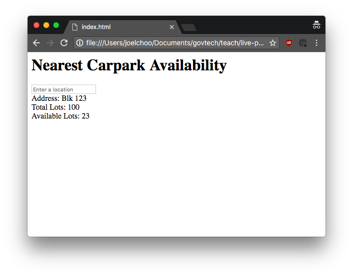

<!-- page_number: true -->
<!-- Rendered using Marp (https://yhatt.github.io/marp/) -->


# Hands On Coding Workshop

---

# Objectives

* Learn more about iterative product development
* Learn about building blocks of web applications
  * Frontend (HTML, Javascript, CSS)
  * APIs and libraries

---

# Overview

* Sharing on Parking.sg
* Hands on coding workshop

---

# Sharing on Parking.sg

---

# Hands on Coding Workshop

---

# What you're going to build


---

# Outline

1. Introduction to HTML - building the skeleton of our site
1. Introduction to Javascript - adding interactivity to our site
1. Introduction to APIs - fetching and displaying data on the site
1. Introduction to CSS - styling the site
1. Deploying the site to the internet
1. Challenge mode - A simple API server

---

# Before we begin

* Slides are provided as handouts
* You can also refer to digital copy of the slides

---

# Step 1 - Displaying some text



---

# Setup

* Open the `index.html` file in **Atom**
  * We will be editing our code in Atom
* Open the `index.html` file in **Google Chrome**
  * You should see nothing on the webpage right now, as the file is empty
  * As we progress, you will see changes you make in the file show up on Chrome by refreshing the page

---

```html
<body>
  hello
</body>
```
* Save the file and refresh the page in Chrome
* HTML files specify the content that the browser should display
* HTML uses tags to differentiate between different parts of the page
  * `<body>` - opening tag for the page's content
  * `</body>` - closing tag
  * Everything between opening and closing tags is the tag's content

<!--
* html, body, opening and closing tags
* Websites are just text files interpreted by the browser
-->

---

```html
<body>
  hello there!
</body>
```
<!--
encourage students to play around with the text and to try putting on different things within the tags and to see the change happen. This gives them a chance to get used to the process of saving a file, changing tabs, and hitting refresh, which is very new to a bunch of them
-->

---

```html
<body>
  hello
  <br>
  there!
</body>
```

* HTML has a specific way of formatting content
* What you see is not necessarily what you get
* HTML does not care about your file and is merely a structure. How might you be able to make them change the file?

---

```html
<body>
  hello<br>
  there!
</body>
```

* Using the `br` tag

---

```html
<body>
  <h1>hello</h1>

  there!
</body>
```

* The `h1` tag makes the content inside become a **header**
* Try using the `<title>` tag

<!--
Tell them about h1-6 tags, and introduce title, so that they know that there is more than just a styling difference between different tags
-->

---

```html
<body>
  <h1>Nearest Carpark Availability</h1>
</body>
```

---

```html
<body>
  <h1>Nearest Carpark Availability</h1>
  <input>
</body>
```

* `input` creates an input box
* `input` tags aren't designed to contain text or other elements, so there is _no_ corresponding closing tag

---

```html
<body>
  <h1>Nearest Carpark Availability</h1>
  <input placeholder="Enter a location">
</body>
```

* HTML tags can have extra **attributes** given to them
* These **attributes** can change the behaviour and appearance of the element

---

```html
<body>
  <h1>Nearest Carpark Availability</h1>
  <input placeholder="Enter a location">

  <div>Hello!</div>
</body>
```

`div`s are containers for content. They define a division in the HTML document

---

# What is HTML?
Hypertext Markup Language (HTML) is the standard **markup language** for documents designed to be displayed in a web browser.

---
## Markup Language
A system for annotating a document in a way that is syntactically distinguishable from the text.


---
## Hypertext

Text with references (usually called hyperlinks) to other text that the reader can immediately access.


---

```html
<body>
  <h1>Nearest Carpark Availability</h1>
  <input placeholder="Enter a location">

  <div>
    Address: Blk 123<br>
    Total Lots: 456<br>
    Available Lots: 78
  </div>
</body>
```

`div`s can be used to organise and arrange content

---

# Result


---

# A short detour

Adding styles to your page!

```html
<body style="background-color: lightskyblue">
  .
  .
  .
</body>
```

What colors can I use? Find the at [https://developer.mozilla.org/en-US/docs/Web/CSS/color_value](https://developer.mozilla.org/en-US/docs/Web/CSS/color_value)

<!-- encourage the use of "color" CSS attribute to change the color of the font that they have
-->

---

Work so far:
```html
<body style="background-color: lightskyblue">
  <h1>Nearest Carpark Availability</h1>
  <input placeholder="Enter a location">

  <div style="color:red">
    Address: Blk 123<br>
    Total Lots: 456<br>
    Available Lots: 78
  </div>
</body>
```
---

# Step 1 - A quick recap

* Webpages all require HTML files in your browser
* HTML tells the browser what to display
* Using HTML tags and attributes

---

# What's next:

## Adding interaction to our page!

---

# Metaphor - the human body

| Term         | Metaphor | Function            |
|--------------|----------|---------------------|
| HTML         | Skeleton | Structure           |
| CSS (styles) | Skin     | Styling, formatting |
| Javascript   | Brain    | Behaviour/actions   |

---

```html
<body>
  .
  .
  .
</body>

<script> alert("Hello!") </script>
```

`script` content is javascript code that the browser will execute

---
Work so far:
```html
<body>
  <h1>Nearest Carpark Availability</h1>
  <input placeholder="Enter a location">

  <div>
    Address: Blk 123<br>
    Total Lots: 456<br>
    Available Lots: 78
  </div>
</body>

<script> alert("Hello!") </script>
```

---

```html
<body>
  <h1>Nearest Carpark Availability</h1>
  <input placeholder="Enter a location">

  <div>
    Address: Blk 123<br>
    Total Lots: 456<br>
    Available Lots: 78
  </div>
</body>

<script src="carpark-logic.js"></script>
```

To make it simpler, we can put the javascript code into another file

---
`carpark-logic.js`
```javascript
alert(3 + 10)
```

Note: For subsequent slides, the slide title is the file you should be editing


---

# What's next

* We need to be able to replace the address and parking lot information dynamically based on what the user searches
* We can do that by using Javascript to:
  1. Find the `div` for carpark address
  1. Change the text inside the `div`
  1. Repeat for parking lot information
* To find the correct `div` for Step 1, we need to give the `div` an ID!

---

`index.html`

```html
<body>
  <h1>Nearest Carpark Availability</h1>
  <input placeholder="Enter a location">

  <div id="carparkInfo"></div>
</body>

<script src="carpark-logic.js"></script>
```

Refresh the page - the address should have disappeared

---

`carpark-logic.js`

```javascript
document.getElementById("carparkInfo").innerHTML =
  "Address: Blk 123"
```

* `document.getElementById` gets the `carparkInfo` `div` in our HTML
* Changing `innerHTML` changes the HTML displayed inside the `carparkInfo` `div`
* You could use `textContent` to change only the text within that `div`
* Refresh the page and the address should reappear

<!-- explain camel casing, point out that "Id" is spelt with capital I, small d -->

---

`carpark-logic.js`

```javascript
document.getElementById("carparkInfo").innerHTML =
  `Address: Blk 123<br>
  Total Lots: 456<br>
  Available Lots: 78`
```

Refresh the page - total and available lots should reappear

---

# Introducing functions

* Functions are like recipes - they're a way to group some instructions together

```javascript
function bakeCake() {
  preheatOven()
  mixIngredients()
  putInOven()
}
```

* `bakeCake` is the function name
* `{` is used to denote the start of function, `}` to denote end
---

# Introducing functions

* Functions are like recipes - they're a way to group some instructions together

```javascript
function bakeCake(flour, eggs) {
  preheatOven()
  mixIngredients(flour, eggs)
  putInOven()
}
```

* `flour` and `eggs` are the function inputs
* `(` denotes the start of function inputs and `)` denotes the end

---

`carpark-logic.js`

```javascript
function addCarparkToPage() {
  document.getElementById("carparkInfo").innerHTML =
  `Address: Blk 123<br>
  Total Lots: 456<br>
  Available Lots: 78`
}
```

* Wrap your existing code into a function (by adding the first and last line)
* `addCarparkToPage` is the name of this function
* The function does not take in any inputs
* Refresh your page - the text should disappear. Why?

---

`carpark-logic.js`

```javascript
function addCarparkToPage() {
  document.getElementById("carparkInfo").innerHTML =
  `Address: Blk 123<br>
  Total Lots: 456<br>
  Available Lots: 78`
}

addCarparkToPage()
```

* Creating a function does not run the code inside yet
* We need to call the function to run the code inside
* Analogy - writing a recipe is different from making a recipe

---

`carpark-logic.js`

```javascript
function addCarparkToPage(address, totalLots, availableLots) {
  document.getElementById("carparkInfo").innerHTML =
  `Address: ${address}<br>
  Total Lots: ${totalLots}<br>
  Available Lots: ${availableLots}`
}
addCarparkToPage("Blk 123", "456", "78")
```

* Add function inputs so that we can easily change the address and parking lot information displayed
* Try changing function inputs and refresh the page

<!-- whip out the console and start showing them how they can change things in there -->

---

# Recap

* Javascript adds interaction
* Javascript connects to HTML using `getElementById`
* A function is a bunch of code that's grouped together
* Calling a function runs the code in it

---

# What's next?

## Reacting to user input

---

`index.html`

```html
<body>
  <h1>Nearest Carpark Availability</h1>
  <input id="locationInput" placeholder="Enter a location">

  <div id="carparkInfo"></div>
</body>

<script src="carpark-logic.js"></script>
```

Give the input element an ID (`locationInput`)

---

`carpark-logic.js`

```javascript
function addCarparkToPage(address, totalLots, availableLots) {
  .
  .
  .
}

addCarparkToPage("Blk 123", "456", "78")

document.getElementById("locationInput")
```

Retrieve the input element using its ID

---

`carpark-logic.js`

```javascript
function addCarparkToPage(address, totalLots, availableLots) {
  .
  .
  .
}


var parkingLocation = document.getElementById("locationInput")
```

* `var` is short for variable
* We're saving the element into the `parkingLocation` variable
* Analogy - saving your word document into Document.docx

<!-- remind them to remove `addCarparkToPage("Blk 123", "456", "78")` from their code
-->

---

`carpark-logic.js`

```javascript
function addCarparkToPage(address, totalLots, availableLots) {
  .
  .
  .
}

var parkingLocation = document.getElementById("locationInput")

parkingLocation.addEventListener("keydown", addCarparkToPage)
```


* React to user typing in the input box by adding an **event listener** (`addEventListener`)
* We tell Javascript to run `addCarparkToPage` function when the user types something (`keydown`)
* Try typing something in the input box - you should see text appear, but something is off

<!-- the reason why we get them to put in the function that they have already coded up is so that they can immediately see the impact of writing the keydown event listener -->

---

`carpark-logic.js`

```javascript
function addCarparkToPage(address, totalLots, availableLots) {
  .
  .
  .
}

var parkingLocation = document.getElementById("locationInput")

parkingLocation.addEventListener("keydown", addCarparkToPage)

function grabLocation(event) {
  addCarparkToPage("Blk 123", "456", "78")
}
```

Create a new function called `grabLocation` that takes in `event` as the first input and calls the `addCarparkToPage` function


<!-- Nothing changes yet -->

---

`carpark-logic.js`

```javascript
.
.
.


parkingLocation.addEventListener("keydown", grabLocation)

function grabLocation(event) {
  addCarparkToPage("Blk 123", "456", "78")
}
```

Change the function inside from `addCarparkToPage` to `grabLocation`

<!-- Type into the input box - the correct text should reappear -->

---

`carpark-logic.js`

```javascript
function grabLocation(event) {
  if (event.key === "Enter") {
    addCarparkToPage("Blk 123", "456", "78")
  }
}
```

* We only want to care about when the `Enter` key is pressed
* `===` is how we check for equality
* `{` once again signifies start of the conditional, `}` denotes the end

---

`carpark-logic.js`

```javascript
function grabLocation(event) {
  console.log(event)
  if (event.key === "Enter") {
    addCarparkToPage("Blk 123", "456", "78")
  }
}
```

* How do engineers find out if something is going wrong
* They print out information from their program and display it
* On your Chrome Browser, right click, select `Inspect`, and see the output when you type into the input box
---

# What's next

Now we need to get the location that we typed in.

We can do that in a similar way to how we injected the text.

Find the input element, and extract it's content.

---

`carpark-logic.js`

```javascript
function grabLocation(event) {
  if (event.key === "Enter") {
    var location = parkingLocation.value
    addCarparkToPage(location, "456", "78")
  }
}
```

* `parkingLocation.value` gets the text that has been typed into the input box
* pass that on to the `addCarparkToPage` function as the first variable

---

# Recap

* React to user input by registering **event listeners**
* Only react to Enter key press
* Get the text that the user has typed in

---

# What's next?


---

# What is an API call?

* Way for apps to communicate (over the internet)
* An API call is like a phone call to a wise person who has the answers to your questions
  * **"What time is it now?"**
  * **"Where are all the carparks in Singapore?"**
  * **"What is the current price of Bitcoin?"**

---

# How do we make an API call?

* We need the help of a request library
* A library is a set of functions that someone else has written
* Like using tools that a wise man created

---

# Why do we use APIs/Libraries?

* Don't reinvent the wheel
  * Passport: For password authentication
  * OpenCV: For image recognition
* Keeps our app simple!
* Some information can only be provided by certain people/organisations (e.g. price of Bitcoin)

<!-- ^standing on the shoulders of giants -->
<!-- ^show repos for different libraries -->
<!-- ^show demo of opencv -->

---

# Our API call

"What are the X and Y coordinates of this location?"

[https://docs.onemap.sg/#onemap-rest-apis](https://docs.onemap.sg/#onemap-rest-apis)

<!-- ^show api documentation -->
<!-- ^what are parameters? -->
<!-- ^what happens if you change parameters? i.e. returnGeom is set to "N"? -->
<!-- ^show api call from browser -->

---

`index.html`

```html
<head>
  <script src="https://unpkg.com/axios/dist/axios.min.js"></script>
</head>

<body>
  ...
</body>

<script src="carpark-logic.js"></script>
```

* Use the script tag to add the `axios` library to your code
* `head` loads our library before the rest of the page

<!-- google "javascript request library" -->

---

# Let's sketch out our logic


---


---

`carpark-logic.js`

```javascript

function grabLocation(event) {
  if (event.key === "Enter") {
    var location = locationInput.value
    getXY(location)
  }
}

function getXY(location) {
  var coordinates = {
    X: "1111",
    Y: "2222"
  }
  getCarpark(coordinates)
}

function getCarpark(coordinates) {
  addCarparkToPage(coordinates.X, coordinates.Y, "78")
}

```

<!-- ^Create the `getXY` and `getCarpark` function -->
Link the functions
Test that coordinates are visible on front end

---

`carpark-logic.js`

```javascript

function getXY(location) {
  axios.get("https://developers.onemap.sg/commonapi/search", {
    params: {
      searchVal: location,
      returnGeom: "Y",
      getAddrDetails: "N"
    }
  }).then(response => {
    var coordinates = {
      X: "1111",
      Y: "2222"
    }
    getCarpark(coordinates)
  })
}

```
Make the API call

---

`carpark-logic.js`

```javascript

function getXY(location) {
  axios.get("https://developers.onemap.sg/commonapi/search", {
    params: {
      searchVal: location,
      returnGeom: "Y",
      getAddrDetails: "N"
    }
  }).then(response => {
    console.log(response)
    var coordinates = {
      X: "1111",
      Y: "2222"
    }
    getCarpark(coordinates)
  })
}

```
What is returned by the API?

<!-- show how developer console is linked to code base (call addCarparkToPage from console) -->
<!-- Show response object from API in browser -->

---

`carpark-logic.js`

```javascript
function getXY(location) {
  axios.get("https://developers.onemap.sg/commonapi/search", {
    params: {
      searchVal: location,
      returnGeom: "Y",
      getAddrDetails: "N"
    }
  }).then(response => {
    console.log(response)
    var coordinates = response.data.results[0]
    getCarpark(coordinates)
  })
}
```

Extract the coordinates from the `response`

---

`carpark-logic.js`

```javascript
function getXY(location) {
  axios.get("https://developers.onemap.sg/commonapi/search", {
    params: {
      searchVal: location,
      returnGeom: "Y",
      getAddrDetails: "N"
    }
  }).then(response => {
    var coordinates = response.data.results[0]
    console.log(coordinates)
    getCarpark(coordinates)
  })
}
```

`console.log` the X and Y coordinates for us to check that it is correct

---

# What's next

* Now we want to get the nearest carpark to that X and Y value
* Slightly too complicated for now, so we can use a library that Joel wrote

---

`index.html`

```html
<head>
  <script src="https://unpkg.com/axios/dist/axios.min.js"></script>
</head>

<body>
  ...
</body>

<script src="carpark-library.js"></script>
<script src="carpark-logic.js"></script>
```

Add `carpark-library.js` to your code

---

`carpark-logic.js`

```javascript
function getCarpark(coordinates) {
  getNearestCarparkTo(coordinates.X, coordinates.Y).then(carpark => {
    addCarparkToPage(carpark.address, carpark.total_lots, carpark.lots_available)
  })
}
```

Call the `getNearestCarparkTo(...)` function from Joel's library

---

# Recap

* Made API call to convert location to X and Y
* Use library function to get the nearest carpark

---

# What's next?

* Content and logic is all done!
* Next - styling your site!

---

`index.html`

```html
<head>
  <script src="https://unpkg.com/axios/dist/axios.min.js"></script>
  <link rel="stylesheet" type="text/css" href="carpark-style.css"></link>
</head>

<body>
  <h1>Nearest Carpark Availability</h1>
  <input id="locationInput" placeholder="Enter a location">

  <div id="carparkInfo"></div>
</body>

<script src="carpark-library.js"></script>
<script src="carpark-logic.js"></script>
```

---

`index.html`

```html
<head>
  <script src="https://unpkg.com/axios/dist/axios.min.js"></script>
  <link rel="stylesheet" type="text/css" href="carpark-style.css"></link>
</head>

<body>
  <h1>Nearest Carpark Availability</h1>
  <input id="locationInput" placeholder="Enter a location">

  <div id="carparkInfo"></div>
</body>

<script src="carpark-library.js"></script>
<script src="carpark-logic.js"></script>
```

---

`carpark-style.css`

```css
body {
  background-image: url("background-image.png");
  background-size: cover;
  background-position: center;

  text-align: center;
  color: #F2F2F2;
  margin-top: 10%;
}

```

Style the `body` - add background image

---

`carpark-style.css`

```css
body {
  background-image: url("background-image.png");
  background-size: cover;
  background-position: center;

  text-align: center;
  color: #F2F2F2;
  margin-top: 10%;
}

```

Style the `body` - font and margin

---

`carpark-style.css`

```css
body {
  /* ... */
}

h1 {
  font-size: 64px;
}

```

Style the `h1`

---


`carpark-style.css`

```css
h1 {
  /* ... */
}

input {
  font-size: 20px;

  width: 70%;
  padding: 12px 20px;
  margin-bottom: 30px;
  border-radius: 4px;
}
```

Style the `input` (search box)

---

`carpark-style.css`

```css
@import url('https://fonts.googleapis.com/css?family=Mandali');

body {
  background-image: url("background-image.png");
  background-size: cover;
  background-position: center;

  text-align: center;
  color: #F2F2F2;
  margin-top: 10%;
  font-family: "Mandali";
}

...

```

Import a font package from fonts.google.com

---

`carpark-style.css`

```css
input {
  /* ... */
}

@media only screen  
  and (max-device-width: 480px) {

  input {
    font-size: 32px;
    width: 95%;
  }
}
```

`@media` query: checking for screen size and then defining a specific style for the element

---

# Recap

* Use CSS Selectors to style the `body`, `h1`, and `input`
* Use `@media` queries to set style for mobile devices

---

# Recap

| Term         | Metaphor | Function            |
|--------------|----------|---------------------|
| HTML         | Skeleton | Structure           |
| CSS (styles) | Skin     | Styling, formatting |
| Javascript   | Brain    | Behaviour/actions   |

---

# Next Step!

* Deploying your app to the internet
* Up to now, your website is just on your computer
* We will now deploy it to the internet so everyone can see and use it!

---

# Deployment

1. Go to [https://www.bitballoon.com/](https://www.bitballoon.com/)
1. Drag and drop the app folder on to the site.
1. Wait for it to process your data
1. Voila! Your site has been hosted!

---

# Recap

1. What a website consists of
1. HTML + Javascript + CSS
1. API calls - communication over the internet
1. Deploying websites

---

# That's all folks!

## Any questions?

---

# Bonus Material
## Building your own simple API server

---

# Next Step - Building your own API

* Build a simple backend to serve a simple API
* We'll replace my helper API with a real API

---

Create a new file called `backend.js`

`backend.js`

```javascript
var express = require("express")

var app = express()

app.listen(3000, function () {
  console.log("Server running...")
})
```

* Open the command line (TAs can help!)
* Type `node backend.js` and hit enter
* You should see `Server running...`

---

`backend.js`

```javascript
var express = require("express")

var app = express()

app.listen(3000, function () {
  console.log("Server running...")
})
```

* Importing `express`, a lightweight server

---

`backend.js`

```javascript
var express = require("express")

var app = express()

app.listen(3000, function () {
  console.log("Server running...")
})
```

* Creating our server

---

`backend.js`

```javascript
var express = require("express")

var app = express()

app.listen(3000, function () {
  console.log("Server running...")
})
```

* Running our server - start listening to requests

---

Right now your server is listening, but doesn't respond to any requests.

You've set up a phone, but you're not answering any calls.

**Next step: make your server respond to incoming requests.**

---

`backend.js`

```javascript
var express = require("express")

var app = express()

app.get("/", function (req, res) {
  res.send("Hello")
})

app.listen(3000, function () {
  console.log("Server running...")
})
```

* Listen to "`/`"
* When "`/`" is requested, send `Hello` as the response

<!-- i.e. my phone number is 98765432 -->
<!-- i.e. when someone calls me at 98765432, say Hello -->

---

`backend.js`

```javascript
var express = require("express")
var getNearestCarparkTo = require("./carpark-library.js")

var app = express()

app.get("/", function (req, res) {
  getNearestCarparkTo(req.query.x, req.query.y).then(carpark => {
    res.set("Access-Control-Allow-Origin", "*")
    res.send(carpark)
  })
})
```

* Send the `x` and `y` values to the helper API
* Helper API responds with the nearest carpark
* Take the carpark and send it back to the requester

---

`backend.js`

```javascript
var express = require("express")
var getNearestCarparkTo = require("./carpark-library.js")

var app = express()

app.get("/", function (req, res) {
  getNearestCarparkTo(req.query.x, req.query.y).then(carpark => {
    res.set("Access-Control-Allow-Origin", "*")
    res.send(carpark)
  })
})

app.listen(3000, function () {
  console.log("Server running...")
})
```

---

`index.html`

```html
<head>
  <script src="https://unpkg.com/axios/dist/axios.min.js"></script>
  <link rel="stylesheet" type="text/css" href="carpark-style.css"></link>
</head>

<body>
  <h1>Nearest Carpark Availability</h1>
  <input id="locationInput" placeholder="Enter a location">

  <div id="carparkInfo"></div>
</body>

<script src="carpark-library.js"></script>
<script src="carpark-logic.js"></script>
```

Delete the highlighted line

---

`index.html`

```html
<head>
  <script src="https://unpkg.com/axios/dist/axios.min.js"></script>
  <link rel="stylesheet" type="text/css" href="carpark-style.css"></link>
</head>

<body>
  <h1>Nearest Carpark Availability</h1>
  <input id="locationInput" placeholder="Enter a location">

  <div id="carparkInfo"></div>
</body>

<script src="carpark-logic.js"></script>
```

Refresh the page - the search should no longer be working

---

`carpark-logic.js`

```javascript
function getCarpark(coordinates) {
  getNearestCarparkTo(coordinates.X, coordinates.Y).then(carpark => {
    addCarparkToPage(carpark.address, carpark.total_lots, carpark.lots_available)
  })
}
```

Delete the highlighted lines

---

`carpark-logic.js`

```javascript
function getCarpark(coordinates) {
  var url = "http://localhost:3000"
  axios.get(url, {
    params: {
      x: coordinates.X,
      y: coordinates.Y
    }
  }).then(carpark => {
    var carpark = response.data
    addCarparkToPage(carpark.address, carpark.total_lots, carpark.lots_available)
  })
}
```

Set up `carpark-logic` to use our backend API
