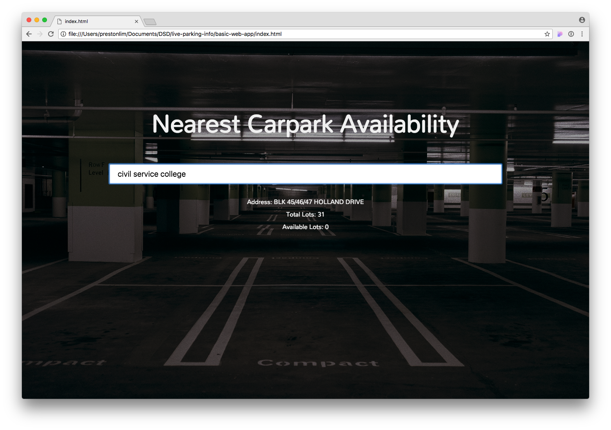
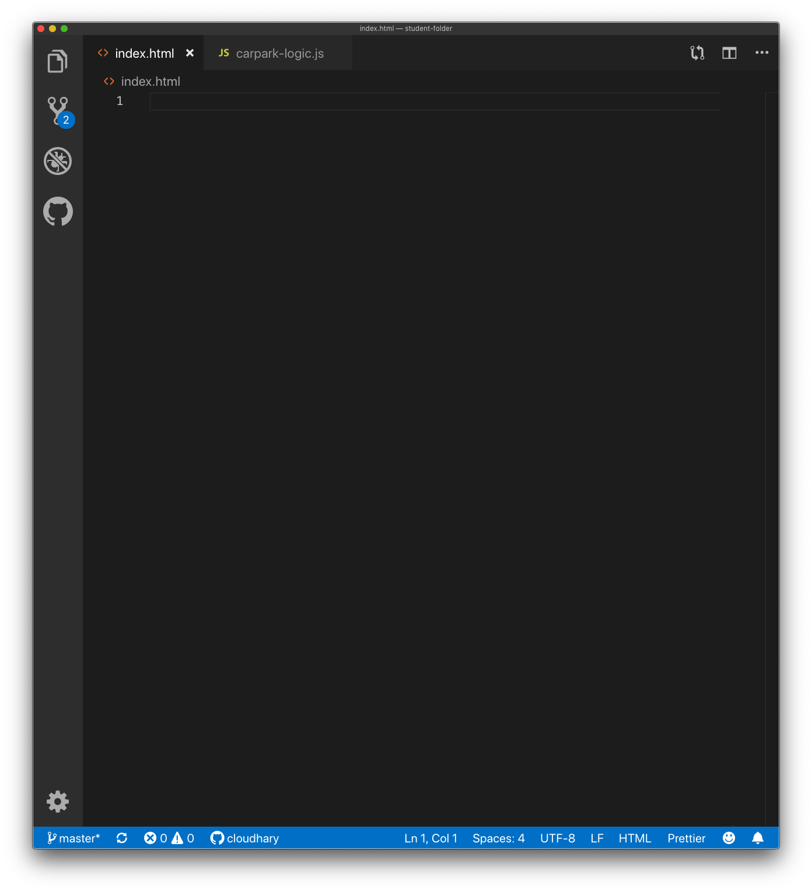
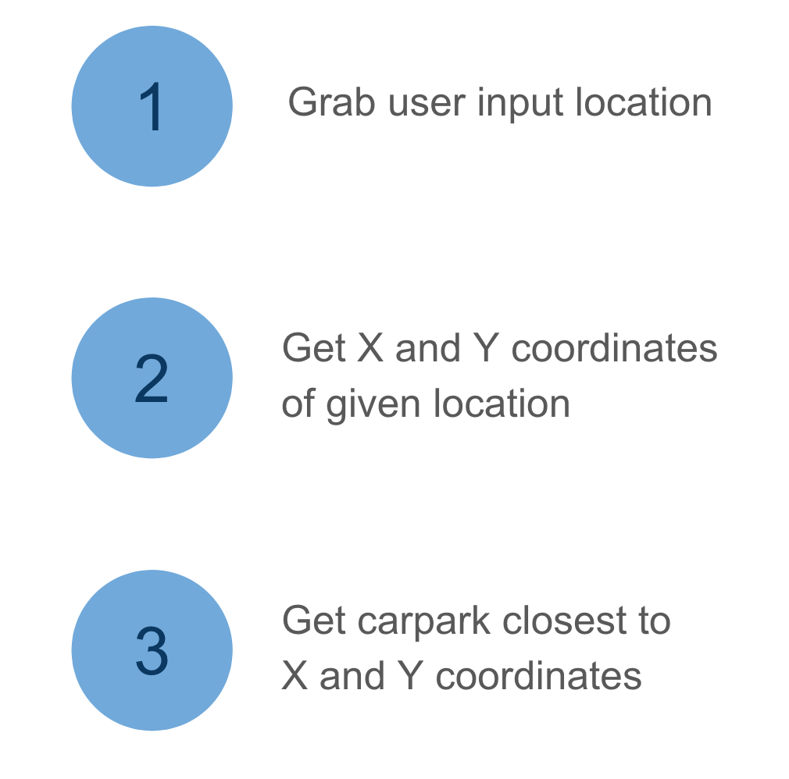

slidenumbers: true
<!-- Rendered using Deckset -->

<!--
General tips for presenters:
- Repeat things twice. People don't get you the first time. This is all very foreign
- Explain even the simplest of things, like === and the difference between ) and }
- Toggle between the final product and the current product so that they know how what you're building is contributing to the final product
- Write comments in your code so that they know what is happening after you stop talking 
- Make sure you highlight the code changes you have made
- Don't answer questions about technical stuff with more jargon than before
-->

<!-- stuff you need on your machine before class
- chrome parser
- Visual Studio Code
- pdf of the slides
-->

# Introduction to Webapp Development

---

# [Open Government Products](https://docs.google.com/presentation/d/1elZPsJ_yze2bRcQ5DVNYjz2NbryRgMS8_caogi1JiEk/edit#slide=id.g4de465b1ea_0_34)

--- 

# Objectives

* Learn more about digital product development
* Learn about building blocks of web applications
  * Frontend (HTML, Javascript, CSS)
  * APIs and libraries
* Be unafraid of code and engineers
---

# Overview

* Sharing on Parking.sg
* Hands on coding workshop

---

# Sharing on Parking.sg

---

# Hands on Coding Workshop

---

# What you're going to build



---

# Outline

1. Introduction to HTML - building the skeleton of our site
1. Introduction to Javascript - adding interactivity to our site
1. Introduction to APIs - fetching and displaying data on the site
1. Introduction to CSS - styling the site
1. Deploying the site to the internet

---

# What to expect

This is a fast paced introduction to web technologies that covers a lot of ground in a very short time

* You may not understand everything by the end of the course
* You don't need to become a proficient coder to understand the basics of web

---
# How we help you
- We have many instructors from diverse backgrounds, so ask them questions
- All material is available online at https://github.com/datagovsg/live-parking-info

---

# Before we begin

* Refer to `presentation/presentation.pdf` for the slides
* Go into `student/` folder to get started

---

# Step 1 - Displaying some text

---

# Setup

* Open the `index.html` file in **Visual Studio Code**
  * We will be editing our code in Visual Studio Code
  * This is a text editor (similar to Notepad) designed for coding
* Open the `index.html` file in **Google Chrome**
  * You should see nothing on the webpage right now, as the file is empty
  * As we progress, you will see changes you make in the file show up on Chrome by refreshing the page

---



---

# What is HTML?
Hypertext Markup Language (HTML) is the standard **markup language** for documents designed to be displayed in a web browser.

---

## Hypertext
Text with references (usually called hyperlinks) to other text that the reader can immediately access.


---

## Markup Language
A system for annotating a document in a way that is syntactically distinguishable from the text.

TODO: Show real html code and the corresponding render

---

```html
<body>
  hello
</body>

```
* Write the above text in the Visual Studio Code text editor
* Save the file and refresh the page in Chrome
* HTML uses tags to differentiate between different parts of the page
* `<body>` - opening tag for the page's content and `</body>` is the closing tag

<!--
* Can we choose what we want to call the tag or does it have to be <body>?
-->

---

```html
<body>
  hello there!
</body>
```
<!--
encourage students to play around with the text and to try putting on different things within the tags and to see the change happen. This gives them a chance to get used to the process of saving a file, changing tabs, and hitting refresh, which is very new to a bunch of them
-->

---

```html
<body>
  hello

  there!
</body>
```

* HTML has a specific way of formatting content
* What you see is not necessarily what you get

---

[.code-highlight: 2]
```html
<body>
  <h1>hello</h1>

  there!
</body>
```

* The `h1` tag makes the content inside become a **header**
* Try using `h2` instead and see the difference

<!--
Tell them about h1-6 tags, and introduce title, so that they know that there is more than just a styling difference between different tags
-->

---

```html
<body>
  <title>Carparks!</title>
  <h1>hello</h1>

  there!
</body>
```
* Optional: try using the `<title>` tag

---

```html
<body>
  <h1>Nearest Carpark Availability</h1>
</body>
```

---

```html
<body>
  <h1>Nearest Carpark Availability</h1>
  <input>
</body>
```

* `input` creates an input box
* `input` tags aren't designed to contain text or other elements, so there is _no_ corresponding closing tag

---

```html
<body>
  <h1>Nearest Carpark Availability</h1>
  <input placeholder="Enter a location">
</body>
```

* HTML tags can have extra **attributes** given to them
* These **attributes** can change the behaviour and appearance of the element

<!-- 
* we're going to create hint text here so that there. Shadow text
* in technical speak, this is called a placeholder
-->
---

```html
<body>
  <h1>Nearest Carpark Availability</h1>
  <input placeholder="Enter a location">

  <div>Hello!</div>
</body>
```

`div`s are containers that are used to organise and arrange content

---

```html
<body>
  <h1>Nearest Carpark Availability</h1>
  <input placeholder="Enter a location">

  <div>123 / 456 lots available at Blk 789</div>
</body>
```

---

# A short detour

Adding styles to your page!

```html
<body style="background-color: lightskyblue">
  .
  .
  .
</body>
```

What colors can I use? Find the at [https://developer.mozilla.org/en-US/docs/Web/CSS/color_value](https://developer.mozilla.org/en-US/docs/Web/CSS/color_value)

<!-- encourage the use of "color" CSS attribute to change the color of the font that they have -->

---


Work so far:

```html
<body style="background-color: lightskyblue">
  <h1>Nearest Carpark Availability</h1>
  <input placeholder="Enter a location">

  <div style="color:red">123 / 456 lots available at Blk 789</div>
</body>
```

* Future code will not have `style` attributes for simplicity

---

# Step 1 - A quick recap

* Webpages all require HTML files in your browser
* HTML tells the browser what to display
* Using HTML tags and attributes

---

# What's next:

## Adding interaction to our page!

---

# Metaphor - the human body

| Term         | Metaphor | Function            |
|--------------|----------|---------------------|
| HTML         | Skeleton | Structure           |
| CSS (styles) | Skin / Clothes     | Styling, formatting |
| Javascript   | Brain    | Behaviour/actions   |

<!-- analogy of a house, with structure, interior design, and smarts -->

---
# What is Javascript?

* Programming language for the Web
* Update and change both HTML and CSS
* Calculate, manipulate and validate data

---

```html
<body>
  <h1>Nearest Carpark Availability</h1>
  <input placeholder="Enter a location">

  <div>123 / 456 lots available at Blk 789</div>
</body>

<script> alert("Hello!") </script>
```

`script` content is javascript code that the browser will execute

---

```html
<body>
  <h1>Nearest Carpark Availability</h1>
  <input placeholder="Enter a location">

  <div>123 / 456 lots available at Blk 789</div>
</body>

<script src="carpark-logic.js"></script>
```

We will split up Javascript and HTML code by writing Javascript in `carpark-logic.js`

---
`carpark-logic.js`

```javascript
alert(3 + 10)
```
* Open up `carpark-logic.js` file in your text editor
* Write the code above in that file and save it
* What do you see?

Note: For subsequent slides, the slide title is the file you should be editing

---

# What's next

* We need to be able to replace the address and parking lot information dynamically based on what the user searches
* We can do that by using Javascript to:
  1. Find the `div` with carpark info
  1. Change the text inside the `div`
* To find the correct `div` for Step 1, we need to give the `div` an identifier!

---

`index.html`

```html
<body>
  <h1>Nearest Carpark Availability</h1>
  <input placeholder="Enter a location">

  <div id="carparkInfo"></div>
</body>

<script src="carpark-logic.js"></script>
```

* Change the `div` tag to remove the text and add an `id`
* Save the file and refresh the page - the address should have disappeared

---

`carpark-logic.js`

```javascript
document.getElementById("carparkInfo").innerText = "No lots available at Blk 789"
```

<!-- explain camel casing, point out that "Id" is spelt with capital I, small d -->

* `document.getElementById` gets the `carparkInfo` `div` in our HTML
* Changing `innerText` changes the HTML displayed inside the `carparkInfo`'s `div`
* Be precise with your spelling and casing - computers are quite unforgiving!
* Save this file and refresh the page and your text should reappear

---

# Introducing functions

* Functions are like recipes - they're a way to group some instructions together

```javascript
function bakeCake() {
  preheatOven()
  mixIngredients()
  putInOven()
}
```

* `bakeCake` is the function name
* `{` is used to denote the start of function, `}` to denote end

---

# Introducing functions

* Functions are like recipes - they're a way to group some instructions together

```javascript
function bakeCake(flour, eggs) {
  preheatOven()
  mixIngredients(flour, eggs)
  putInOven()
}
```

* `flour` and `eggs` are the function inputs
* `(` denotes the start of function inputs and `)` denotes the end

---

`carpark-logic.js`

```javascript
function addCarparkToPage() {
  document.getElementById("carparkInfo").innerText = "No lots available at Blk 789"
}
```

* Wrap your existing code into a function (by adding the first and last line)
* `addCarparkToPage` is the name of this function
* The function does not take in any inputs
* When you refresh your page, the text disappears. Why?

---

`carpark-logic.js`

```javascript
function addCarparkToPage() {
  document.getElementById("carparkInfo").innerText = "No lots available at Blk 789"
}

addCarparkToPage()
```

* Creating a function does not run the code inside yet
* We need to call the function to run the code inside
* Analogy - writing a recipe is different from making a recipe

---

`carpark-logic.js`

```javascript

function addCarparkToPage(address) {
  document.getElementById("carparkInfo").innerText = "No lots available at " + address

}

addCarparkToPage("Blk 000")
```

* Add one function input to take in an address
* Try changing function inputs and refresh the page

---

`carpark-logic.js`

```javascript
function addCarparkToPage(availableLots, totalLots, address) {
  document.getElementById("carparkInfo").innerText = availableLots + " / " + totalLots + " lots available at " + address
}

addCarparkToPage("123", "456", "Blk 789")
```

* Add function inputs so that we can easily change the address and parking lot information displayed
* Try changing function inputs and refresh the page

<!-- whip out the console and start showing them how they can change things in there -->

---

# Recap

* Javascript adds interaction
* Javascript connects to HTML using `getElementById`
* A function is a bunch of code that's grouped together
* Calling a function runs the code in it

---

# What's next?

## Reacting to user input

---

`index.html`

```html
<body>
  <h1>Nearest Carpark Availability</h1>
  <input placeholder="Enter a location" id="locationInput">

  <div id="carparkInfo"></div>
</body>

<script src="carpark-logic.js"></script>
```

Give the input element the `locationInput` identifier

---

`carpark-logic.js`

```javascript
function addCarparkToPage(address, totalLots, availableLots) {
  .
  .
}

addCarparkToPage("123", "456", "Blk 789")

document.getElementById("locationInput")
```

Retrieve the input element using its ID

---

`carpark-logic.js`

[.code-highlight:8]
```javascript
function addCarparkToPage(address, totalLots, availableLots) {
  .
  .
}

addCarparkToPage("123", "456", "Blk 789")

var parkingLocation = document.getElementById("locationInput")
```

* `var` is short for variable
* We're saving the element into the `parkingLocation` variable
* Analogy - saving your word document into Document.docx

<!-- remind them to remove `addCarparkToPage("Blk 789", "456", "78")` from their code -->

---

`carpark-logic.js`

[.code-highlight:8]
```javascript
function addCarparkToPage(address, totalLots, availableLots) {
  .
  .
}

var parkingLocation = document.getElementById("locationInput")

parkingLocation.addEventListener("keydown", addCarparkToPage)
```

* Remove the `addCarparkToPage("123", "456", "Blk 789")` and add the event listener
* React to user typing in the input box by adding an **event listener** (`addEventListener`)
* We tell Javascript to run `addCarparkToPage` function when the user types something (`keydown`)
* Try typing something in the input box - you should see text appear, but something is off

<!-- the reason why we get them to put in the function that they have already coded up is so that they can immediately see the impact of writing the keydown event listener -->

---

`carpark-logic.js`

[.code-highlight: 7-12]

```javascript
function addCarparkToPage(address, totalLots, availableLots) {
  .
  .
}

var parkingLocation = document.getElementById("locationInput")

parkingLocation.addEventListener("keydown", insertLocation)

function insertLocation(event) {
  addCarparkToPage("123", "456", "Blk 789")
}
```

---

`insertLocation` in `carpark-logic.js`

```javascript
function insertLocation(event) {
  if (event.key === "Enter") {
    addCarparkToPage("123", "456", "Blk 789")
  }
}
```

* We only want to care about when the `Enter` key is pressed
* `===` is an equality check
* `{` once again signifies start of the conditional and `}` denotes the end

---

`insertLocation` in `carpark-logic.js`

```javascript
function insertLocation(event) {
  console.log(event.key)
  if (event.key === "Enter") {
    addCarparkToPage("123", "456", "Blk 789")
  }
}
```

* What if you wanted to use some other key?
* On your Chrome Browser, right click, select `Inspect`, and see the output when you type into the input box

---

# What's next

Now we need to get the location that we typed in.

We can do that in a similar way to how we injected the text.

Find the input element, and extract its content.

---

`insertLocation` in `carpark-logic.js`

```javascript
function insertLocation(event) {
  if (event.key === "Enter") {
    var searchLocation = parkingLocation.value
    addCarparkToPage(searchLocation, "456", "78")
  }
}
```

* `parkingLocation.value` gets the text that has been typed into the input box
* pass that on to the `addCarparkToPage` function as the first variable

---

# Recap

* React to user input by registering **event listeners**
* Only react to Enter key press
* Get the text that the user has typed in

---

# What's next?




---

# What is an API call?

* Way for apps to communicate (over the internet)
* An API call is like a phone call to a wise person who has the answers to your questions
  * **"What time is it now?"**
  * **"Where are all the carparks in Singapore?"**
  * **"What is the current price of Bitcoin?"**

---

# How do we make an API call?

* We need the help of a request library
* A library is a set of functions that someone else has written
* Like using tools that a wise man created

---

# Why do we use APIs/Libraries?

* Don't reinvent the wheel
  * Passport: For password authentication
  * OpenCV: For image recognition
* Keeps our app simple!
* Some information can only be provided by certain people/organisations (e.g. price of Bitcoin)


<!-- 
show repos for different libraries
show demo of opencv
 -->

---

# Demo of OpenCV

* We can stand on the shoulders of giants by using these libraries
* Value adding instead of rebuilding

---

# Our API call

"What are the X and Y coordinates of this location?"

[https://docs.onemap.sg/#onemap-rest-apis](https://docs.onemap.sg/#onemap-rest-apis)

<!-- show api documentation -->
<!-- what are parameters? -->
<!-- what happens if you change parameters? i.e. returnGeom is set to "N"? -->

---

Go to [https://developers.onemap.sg/commonapi/search?searchVal=revenue&returnGeom=Y&getAddrDetails=Y&pageNum=1](https://developers.onemap.sg/commonapi/search?searchVal=revenue&returnGeom=Y&getAddrDetails=Y&pageNum=1)

Try the following:
- In the URL, change `jurong` to `toa payoh`
- change the `Y` to `N`

Note which parameters are required and which are optional, and which are accepted values for returnGeom and getAddrDetails

---

`insertLocation` in `carpark-logic.js`

```javascript
function insertLocation(event) {
  if (event.key === "Enter") {
    var searchLocation = locationInput.value
    var url = "https://developers.onemap.sg/commonapi/search?searchVal=" + searchLocation + "&returnGeom=Y&getAddrDetails=N"
    console.log(url)
  }
}
```

* Click on the link in the console. Does it give you the correct information?

<!-- Create the `getXY` and `getCarpark` function
Link the functions
Test that coordinates are visible on front end
-->
---

<!-- google "javascript request library" -->

`index.html`

[.code-highlight: 1-3]

```html
<head>
  <script src="https://unpkg.com/axios/dist/axios.min.js"></script>
</head>

<body>
  .
  .
  .
</body>

<script src="carpark-logic.js"></script>
```

* `axios` is how we tell the browser to retrieve the information we want
* Use the script tag to add the `axios` library to your code

<!-- show them what the minified version of the code looks like in the link -->

---
`insertLocation` in `carpark-logic.js`

[.code-highlight: 1, 5]
[.code-highlight: all]

```javascript
async function insertLocation(event) {
  if (event.key === "Enter") {
    var searchLocation = locationInput.value
    var url = "https://developers.onemap.sg/commonapi/search?searchVal=" + searchLocation + "&returnGeom=Y&getAddrDetails=N"
    var response = await axios.get(url)
    console.log(response)
  }
}
```
* We `await` for the response from the API, cause that takes time
* Where is the information within the object?

<!-- Just like when you ask for people who are going to make  -->
---

`insertLocation` in `carpark-logic.js`

[.code-highlight: 6]
```javascript
async function insertLocation(event) {
  if (event.key === "Enter") {
    var searchLocation = locationInput.value
    var url = "https://developers.onemap.sg/commonapi/search?searchVal=" + searchLocation + "&returnGeom=Y&getAddrDetails=N"
    var response = await axios.get(url)
    console.log(response.data.results[0])
  }
}
```

---

# What's next

* Now we want to get the nearest carpark to that X and Y value
* Slightly too complicated for now, so we've written a library to help with that

---

`index.html`

[.code-highlight: 10]
```html
<head>
  <script src="https://unpkg.com/axios/dist/axios.min.js"></script>
</head>

<body>
  ...
</body>

<script src="carpark-logic.js"></script>
<script src="carpark-library.js"></script>
```

Add `carpark-library.js` to your code

---

`insertLocation` in `carpark-logic.js`

```javascript
async function insertLocation(event) {
  if (event.key === "Enter") {
    var searchLocation = locationInput.value
    var url = "https://developers.onemap.sg/commonapi/search?searchVal=" + searchLocation + "&returnGeom=Y&getAddrDetails=N"
    var response = await axios.get(url)
    var nearestLocation = response.data.results[0]
    var carpark = await getNearestCarparkTo(nearestLocation.X, nearestLocation.Y)
    console.log(carpark)
  }
}
```
* Call the `getNearestCarparkTo(...)` function and provide it with X and Y coordinates
* What does `carpark` hold?

---

`insertLocation` in `carpark-logic.js`

```javascript
async function insertLocation(event) {
  if (event.key === "Enter") {
    var searchLocation = locationInput.value
    var url = "https://developers.onemap.sg/commonapi/search?searchVal=" + searchLocation + "&returnGeom=Y&getAddrDetails=N"
    var response = await axios.get(url)
    var nearestLocation = response.data.results[0]
    var carpark = await getNearestCarparkTo(nearestLocation.X, nearestLocation.Y)
    addCarparkToPage(carpark.address, carpark.total_lots, carpark.lots_available)
  }
}

```

---


# Recap

* Made API call to convert location to X and Y
* Used library function to get the nearest carpark

---

# What's next?

* Content and logic is all done!
* Next - styling your site!

---

`index.html`

[.code-highlight: 3]
```html
<head>
  <script src="https://unpkg.com/axios/dist/axios.min.js"></script>
</head>

<body>
  <h1>Nearest Carpark Availability</h1>
  <input id="locationInput" placeholder="Enter a location">

  <div id="carparkInfo"></div>
</body>

<script src="carpark-library.js"></script>
<script src="carpark-logic.js"></script>
<link rel="stylesheet" type="text/css" href="carpark-style.css"></link>
```

---

`carpark-style.css`

```css
body {
  background-image: url("background-image.png");
  background-size: cover;
  background-position: center;

  text-align: center;
  color: #F2F2F2;
  margin-top: 10%;
}

```

* Style the `body`
* Add each line one at a time and see the change

---

`carpark-style.css`

```css
h1 {
  font-size: 64px;
}

```

Style the `h1`

---


`carpark-style.css`

```css
input {
  font-size: 20px;

  width: 70%;
  padding: 12px 20px;
  margin-bottom: 30px;
  border-radius: 4px;
}
```

Style the `input` (search box)

---

`carpark-style.css`

```css
@import url('https://fonts.googleapis.com/css?family=Mandali');

body {
  background-image: url("background-image.png");
  background-size: cover;
  background-position: center;

  text-align: center;
  color: #F2F2F2;
  margin-top: 10%;
  font-family: "Mandali";
}

...

```

Import a font package from fonts.google.com

---

`carpark-style.css`

```css
@media only screen  
  and (max-device-width: 480px) {

  input {
    font-size: 32px;
    width: 95%;
  }
}
```

`@media` query: checking for screen size and then defining a specific style for the element

---

# Recap

* Use CSS Selectors to style the `body`, `h1`, and `input`
* Use `@media` queries to set style for mobile devices

---

# Recap

| Term         | Metaphor | Function            |
|--------------|----------|---------------------|
| HTML         | Skeleton | Structure           |
| CSS (styles) | Skin / Clothes     | Styling, formatting |
| Javascript   | Brain    | Behaviour/actions   |

---

# Next Step!

* Deploying your app to the internet
* Up to now, your website is just on your computer
* We will now deploy it to the internet so everyone can see and use it!

---

# Deployment

1. Go to [https://www.bitballoon.com/](https://www.bitballoon.com/)
1. Drag and drop the app folder on to the site.
1. Wait for it to process your data
1. Voila! Your site has been hosted!

---

# Recap

1. What a website consists of
1. HTML + Javascript + CSS
1. API calls - communication over the internet
1. Deploying websites

---

# That's all folks!

## Any questions?

---

# Challenge Mode

If you're done and would like a little more of a challenge, try doing these:

- Loading information takes time. Is there any way we can give the user visual feedback while they're waiting?
- Can we show additional information for the nearest carpark? Can we display an icon based on carpark type?
- Can we show the three nearest carparks instead of only one?
